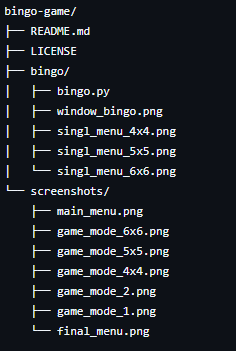
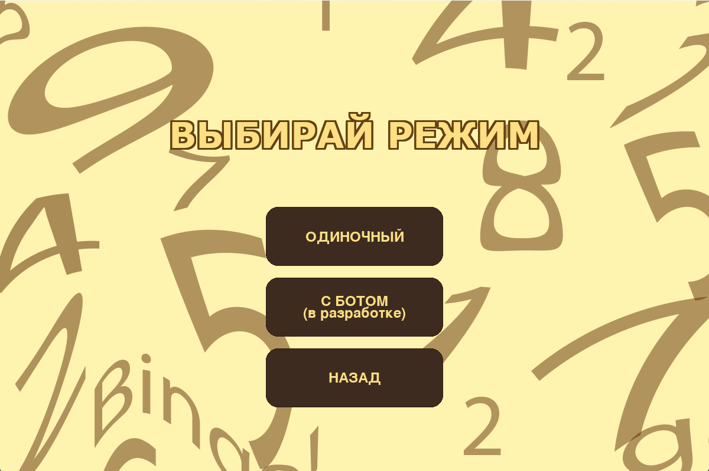
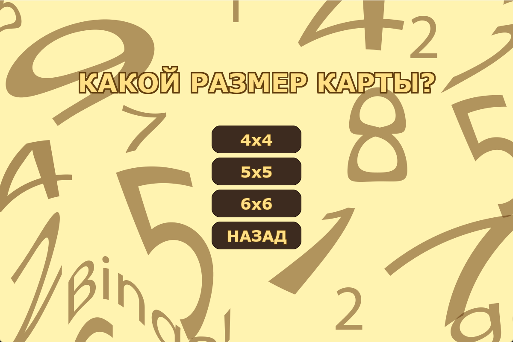
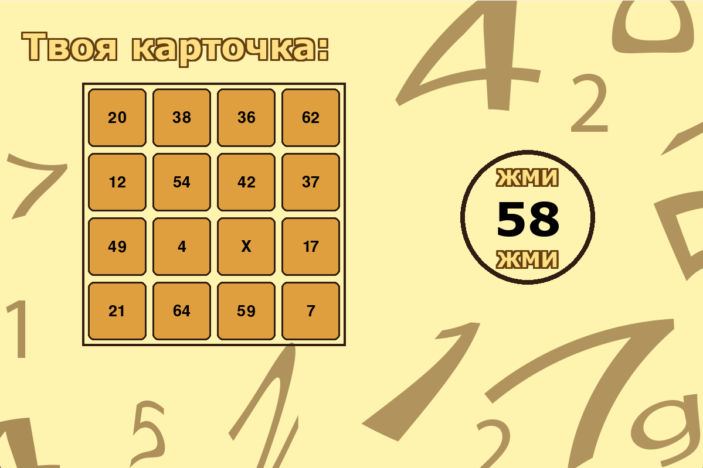
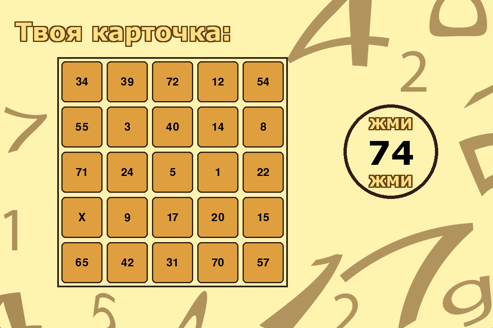
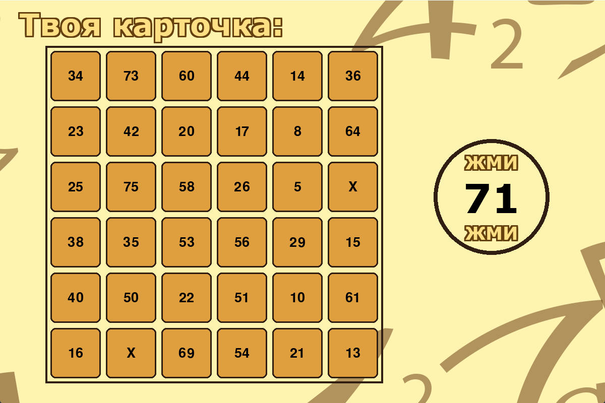
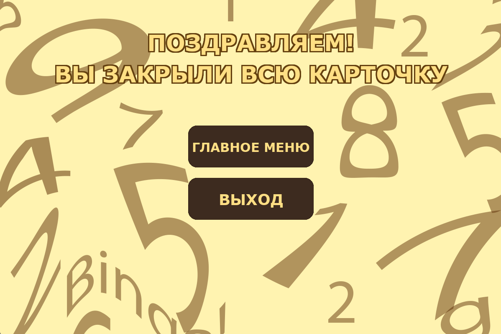

# Bingo Game 🎲

Bingo — это интерактивная игра на Python с графическим интерфейсом на Pygame.  
Игрок крутит числа,а программа закрывает их на своей карточке. Побеждает тот, кто закроет всю карточку.

---

## 🖥️ Технологии

- Python 3.x  
- Pygame

---

## 🎮 Особенности игры

- Выбор размера карточки: 4x4, 5x5, 6x6  
- Генерация уникальных чисел на карточке  
- Пошаговое вытягивание чисел  
- Интерактивный интерфейс с кнопками
- Финальное меню при победе

---

## 📂 Структура проекта



---

## 🚀 Как запустить игру

1. Склонируйте репозиторий:

```bash
git clone https://github.com/kiruxa097/bingo-game.git
```

2. Перейдите в папку с игрой:

```bash
cd bingo-game/bingo
```

3. Установите Pygame (если еще не установлен):

```bash
pip install pygame
```

4. Запустите игру:

```bash
python bingo.py
```

## 📸 Интерфейс игры









---

## 👨‍💻 Автор

Кирилл

---

## 📝 Лицензия

Этот проект распространяется под лицензией MIT. Смотрите файл LICENSE для деталей.
